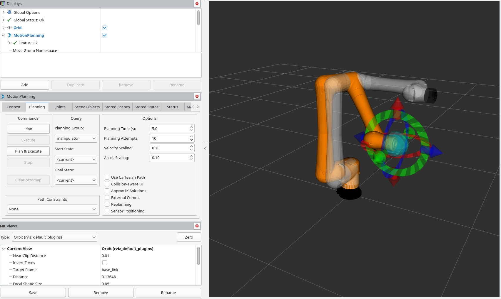

# CRX_moveit_config

This folder contains all the packages to allow commanding the robots from moveit and the remote pc.

To test this with mock robots copy this into your terminal

```console
ros2 launch fanuc_control robot_bringup.launch.py robot_type:=crx10ia_l use_mock_hardware:=true
```

<p align="center">

</p>

## NOTE

By default, the maximum velocities are set to 0.2 of the nominal maximum velocities. This is due to the fact that the actual robot "cuts" velocities greater that 250mm/s at the TCP (can be risen up to 1000mm/s) due to safety constraints. 
When this happens, trajectory traking is not guaranteed, and most of the time the command and the actual positions diverge.
Limiting the maximum joint velocities to 0.2 should avoid reaching the maximum allowed TCP speed.